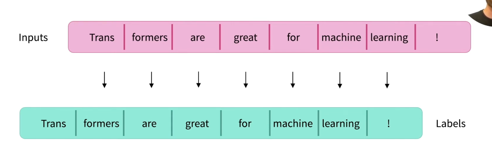

# CS336 Lecture 1 片段：模型设计的高层原则

- 讲义材料：https://cs336.stanford.edu/lectures?trace=lecture_01

> High-level principle: everything is about balancing the following:

- **Expressivity**：能表示数据里的复杂依赖关系。
- **Stability**：让参数范数和梯度范数保持在合适区间，避免训练不稳定。
- **Efficiency**：训练和推理时都能在硬件上跑得快。

我的理解：模型设计不是单独追求某一项，而是在表达能力、训练稳定性和硬件效率之间做权衡。

## 待读材料

- **How to Scale Your Model**
  - 作用：从系统角度讲 LLM scaling 的高层概念。
  - 注意：这本书来自 Google，会更偏 TPU，但高层概念和 GPU 系统相通。

- **Andrej Karpathy: Let's build the GPT Tokenizer**
  - 链接：https://www.youtube.com/watch?v=zduSFxRajkE
  - 作用：CS336 tokenization 单元推荐视频，用来补 tokenizer / BPE 的直观理解。

- **Hugging Face Transformers: Causal language modeling**
  - 链接：https://huggingface.co/docs/transformers/en/tasks/language_modeling
  - 作用：看 `input_ids -> labels -> loss` 如何对应 next-token prediction。

- **Hugging Face Transformers: GPT-2 model forward**
  - 链接：https://huggingface.co/docs/transformers/en/model_doc/gpt2#transformers.GPT2LMHeadModel.forward
  - 作用：确认 `labels` 的语义，尤其是 causal LM 里 labels 会在模型内部 shift。

## 课程大纲

```python
def course_syllabus():
    basics()        # Assignment 1: tokenization, model architecture, training
    systems()       # Assignment 2: kernels, parallelism, inference
    scaling_laws()  # Assignment 3: scaling laws
    data()          # Assignment 4: evaluation, curation, transformation, filtering, deduplication
    alignment()     # Assignment 5: RLHF, RL algorithms, RL systems
```

### 1. Basics

要学什么：先把语言模型最小 pipeline 跑通，包括 tokenization、模型架构和训练。

Assignment 1：实现 tokenizer、Transformer 基本结构、loss、optimizer 和 training loop。

### 2. Systems

要学什么：让模型在硬件上跑得快，包括 kernels、并行训练和推理。

Assignment 2：理解/实现 kernel 优化、分布式并行、inference 相关系统能力。

### 3. Scaling Laws

要学什么：用小规模实验预测大规模训练效果，判断参数量、数据量和算力预算怎么配。

Assignment 3：围绕 scaling laws 做实验和预测。

### 4. Data

要学什么：训练数据从哪里来、怎么评估、清洗、转换、过滤和去重。

Assignment 4：处理真实数据，做 evaluation、curation、transformation、filtering、deduplication。

### 5. Alignment

要学什么：把 base model 调成更符合人类需求/任务需求的 assistant，包括 RLHF、RL 算法和 RL 系统。

Assignment 5：围绕 RLHF、RL algorithms、RL systems 做 alignment 训练。

## Tokenizer

### Observations

- 一个单词和它前面的空格常常会被合成同一个 token，例如 `" world"`。
- 同一个词出现在句首和句中，可能会被表示成不同 token，例如 `"hello hello"` 里的两个 `hello`。
- 数字通常会被切成每几位一组的 token，而不是整个数字作为一个 token。

我的理解：tokenizer 不是按“人眼里的单词”切，而是按训练语料里高频、方便压缩的字符串片段切。所以空格、位置和数字格式都会影响 token 表示。

### Compression ratio

```python
compression_ratio = get_compression_ratio(string, indices)
```

- Compression ratio：每个 token 平均压缩了多少 bytes，即 `number of bytes per token`。
- compression ratio 越大，token 序列越短；这通常是好事，因为 attention 的计算量随 sequence length 二次增长。
- 可以通过增大 vocabulary size 来提高 compression ratio，因为可用 token 值更多，更容易把长片段合成一个 token。
- 代价：vocabulary size 变大后，每个 token 的出现会更稀疏，带来 sparsity 问题。

### 四种 tokenizer 方案

#### 1. Character tokenizer

Unicode string 可以看作 Unicode character 的序列，每个 character 可以用 `ord` 转成 code point，再用 `chr` 转回来。

```python
assert ord("a") == 97
assert ord("🌍") == 127757
assert chr(97) == "a"
assert chr(127757) == "🌍"

tokenizer = CharacterTokenizer()
string = "Hello, 🌍! 你好!"
indices = tokenizer.encode(string)              # call ord
reconstructed = tokenizer.decode(indices)        # call chr
assert string == reconstructed
```

优点：简单、可逆，任何 Unicode 字符都能表示。

问题：

- Unicode 大约有 150K 个字符，vocabulary 很大。
- 很多字符非常少见，例如 `🌍`，vocab 利用率低。
- 一个字符一个 token，compression ratio 不高。

结论：character tokenizer 是 “large vocabulary + low compression ratio”，两边都不占优。

#### 2. Byte tokenizer

Unicode string 可以先用 UTF-8 表示成 bytes，每个 byte 是 `0..255` 之间的整数。

```python
assert bytes("a", encoding="utf-8") == b"a"
assert bytes("🌍", encoding="utf-8") == b"\xf0\x9f\x8c\x8d"

tokenizer = ByteTokenizer()
string = "Hello, 🌍! 你好!"
indices = tokenizer.encode(string)
reconstructed = tokenizer.decode(indices)
assert string == reconstructed
```

优点：

- vocabulary 固定且很小：`256`。
- 所有 Unicode 文本都可以通过 UTF-8 bytes 表示，不需要 `UNK`。

问题：

- compression ratio 等于 `1`：一个 byte 一个 token。
- 序列会很长，而 Transformer attention 对 sequence length 是二次复杂度。

结论：byte tokenizer 的 vocab 很漂亮，但序列太长。

#### 3. Word tokenizer

传统 NLP 更接近这种做法：把字符串切成词和符号 chunk。

```python
string = "I'll say supercalifragilisticexpialidocious!"
chunks = regex.findall(r"\w+|.", string)
```

优点：

- token 更接近人类理解的 “词”，语义更完整。
- compression ratio 通常较好，因为一个 token 可以覆盖多个 bytes。

问题：

- vocabulary size 可能巨大，因为训练数据里 distinct words / chunks 很多。
- 很多词非常罕见，模型很难学好。
- 不自然地固定 vocabulary size。
- 训练时没见过的新词需要 `UNK` token，这会损失信息，也会影响 perplexity 计算。

结论：word tokenizer 的 compression ratio 好，但 vocab 不可控，未知词处理很丑。

#### 4. BPE tokenizer

BPE（Byte Pair Encoding）最初由 Philip Gage 在 1994 年提出用于数据压缩，后来被 Sennrich 等人在 2015 年用于神经机器翻译，再后来被 GPT-2 使用。

基本想法：在原始文本上训练 tokenizer，让 vocabulary 适配数据分布。

- 常见 byte 序列：合并成一个 token。
- 罕见 byte 序列：拆成多个 token。
- 起点是 byte tokenizer，所以天然可以覆盖所有 Unicode 文本。

训练过程：

```python
string = "the cat in the hat"
params = train_bpe(string, num_merges=3)
```

使用过程：

```python
tokenizer = BPETokenizer(params)
string = "the quick brown fox"
indices = tokenizer.encode(string)
reconstructed = tokenizer.decode(indices)
assert string == reconstructed
```

结论：BPE 是折中方案。它保留 byte tokenizer 的可覆盖性，又通过 merge 常见片段提高 compression ratio，同时 vocabulary size 可以通过 `num_merges` 控制。

### 一个例子串起来

同一个字符串：

```text
Hello, 🌍! 你好! supercalifragilisticexpialidocious 1234567890
```

四种 tokenizer 会做出不同取舍：

| tokenizer | 大概怎么切 | vocab size | compression ratio | 主要问题 |
|-----------|------------|------------|-------------------|----------|
| Character | `H`, `e`, `l`, ..., `🌍`, `你`, `好` | 很大，Unicode 字符很多 | 不高 | rare character 浪费 vocab |
| Byte | UTF-8 bytes；`🌍` 会变成 4 个 bytes，中文每字通常 3 个 bytes | 固定 256 | 最差，约 1 byte/token | 序列太长 |
| Word | `Hello`, 标点, `你好`, 长英文词, 数字串 | 可能巨大 | 好 | 新词要 `UNK`，vocab 不可控 |
| BPE | 常见片段合并，罕见长词拆成 subword/bytes，数字也可能几位一组 | 可控，`256 + num_merges` 左右 | 较好 | 需要训练 tokenizer，切分结果不一定符合人类直觉 |

这四种方案的演进逻辑：

```text
character: 能表示所有字符，但 vocab 大、压缩差
-> byte: vocab 小且全覆盖，但序列太长
-> word: 序列短、语义强，但 vocab 爆炸且有 UNK
-> BPE: 从 byte 出发，通过合并高频片段，在 vocab size 和 compression ratio 之间折中
```

### 明天实践：BPE tokenizer implementation

讲义里的最小 BPE 流程：

```python
# Training the tokenizer
string = "the cat in the hat"
params = train_bpe(string, num_merges=3)

# Using the tokenizer
tokenizer = BPETokenizer(params)
string = "the quick brown fox"
indices = tokenizer.encode(string)
reconstructed_string = tokenizer.decode(indices)
assert string == reconstructed_string
```

Assignment 1 会在这个基础上继续做：

- `encode()` 不要每次遍历所有 merges，只遍历真正相关的 merges。
- 检测并保留 special tokens，例如 `<|endoftext|>`。
- 使用 pre-tokenization，例如 GPT-2 tokenizer regex。
- 尽量优化实现速度。

定位：这部分适合明天作为 tokenizer 实践，不是今天 A 线的主任务。

## Causal LM：input_ids / labels / loss



这张图是 `input_ids -> labels -> loss` 的核心关系：

- 输入和 labels 来自同一串 token。
- 训练目标不是“复制当前 token”，而是用当前位置的输入去预测下一个 token。
- 例如看到 `Trans`，要预测 `formers`；看到 `formers`，要预测 `are`。
- 所以 causal LM 训练时可以设置 `labels = input_ids`，因为模型内部会做 shift，再用 shifted labels 计算 cross entropy loss。

一句话：`input_ids` 是模型看到的前文，`labels` 是每个位置要预测的下一个 token。

## Pretraining / SFT / DPO / RLVR-GRPO

### 四个一句话定义

- **Pretraining**：搭 tokenizer、模型架构和大规模语料，用 `input_ids -> labels -> loss` 的 next-token prediction 训练出 base model。
- **SFT**：在 base model 上继续用监督数据训练，例如 instruction、回答、代码片段或 coding-agent trajectory，让模型更像这些高质量示范数据。
- **DPO**：用 `chosen / rejected` 偏好对直接优化模型，让模型更偏向被选择的回答；它不需要像 PPO 那样先训练 reward model 再做在线 RL。
- **RLVR / GRPO**：用可验证 reward 或规则化 reward 进一步优化模型行为；GRPO 用一组候选回答的相对好坏来更新，省掉单独的 critic。

### 我的理解

CS336 的流程可以理解成：先从 tokenizer 开始，把文本变成 token；再搭建模型架构；然后构建大量语料，把同一串 token 作为 `input_ids` 和 `labels`，通过内部 shift 训练 next-token prediction。训练完得到的是 base model，它主要学会“接着写”。

在 base model 之上，如果想让模型有某种倾向性，就要做后训练。比如要做 coding 能力，就收集高质量代码、代码问答、debug 过程或 coding-agent trajectory 做 SFT；SFT 仍然是监督学习，只是数据分布从通用语料变成了目标行为示范。

如果没有足够多高质量示范，或者想优化“哪个回答更好”这类偏好，就可以用偏好优化或 RL。PPO 典型流程是训练 reward model，再用 reward 训练 policy；DPO 则更简单，直接用 chosen/rejected 偏好对更新模型，所以形式上很接近 SFT，但目标函数是在拉开 chosen 和 rejected 的概率差距；GRPO 更偏 RLVR，用同一问题的一组输出做相对比较，省掉 critic。

## Coding-agent failure 如何进入 post-training

一个真实 coding-agent 失败可以先从失败点开始做 BoN（best-of-N）继续 rollout：

- 如果 N 次里有成功也有失败，说明任务大概在当前模型能力边界附近。成功轨迹可以被整理成 SFT 数据，失败轨迹可以用来做对比、偏好样本或 failure analysis。
- 如果 BoN 全部失败，说明任务对当前模型太难。这时可以用强模型提供 hint / plan /关键定位，让原模型在提示下做出来；训练时把 hint 部分 mask 掉，只让模型学习最终可见轨迹，从而做 hint-assisted SFT。
- 另一条路是把这个失败样本改造成 RL 题目：给模型同一个 issue / repo / tests 环境，让它自己 rollout 修改代码，reward 来自可验证结果，例如测试是否通过、diff 是否干净、是否没有无关修改。

RL 版本的关键是把 coding 任务变成一个可交互环境：

- **state**：repo、issue 描述、上下文、测试结果、工具输出。
- **action**：模型生成的命令、文件读取、patch、测试运行、最终回答。
- **reward**：最直接的是 tests pass / fail；更细可以加入 lint、无无关文件修改、修复是否最小、是否遵守指令。
- **rollout**：同一个任务可以采样多条轨迹，比较成功和失败，或者比较一组候选的相对好坏。
- **training signal**：SFT 学成功轨迹；DPO 学 chosen/rejected；GRPO/RLVR 用 reward 或组内相对优势去更新模型。

我的理解：SFT 更像“把正确做法教给模型”，RL 更像“让模型在可验证环境里自己试，成功就加强、失败就减弱”。Coding agent 比普通聊天更适合 RLVR，因为很多结果可以被测试、编译、静态检查或 diff 规则验证。

## 最小链路：token -> causal LM loss -> SFT data

文本、代码、diff、tool call 和 agent trajectory 本质上都要先被序列化成字符串，再经过 tokenizer 变成 token ids。tokenizer 决定了这些内容如何被切分，比如文件路径、函数名、错误日志、patch 里的符号都会变成模型实际看到的 token 序列。

在 causal LM 训练里，模型输入是 `input_ids`，训练标签通常也是同一串 token ids，也就是 `labels = input_ids`。这并不意味着模型在学习复制当前 token，因为 decoder-only 模型内部会做 shift：第 `t` 个位置的 logits 用来预测第 `t+1` 个 token。loss 通常是 cross entropy，衡量模型给下一个正确 token 分配的概率是否足够高。

Pretraining 阶段把大规模通用语料转成这样的 token 序列，让模型学习“在一般文本和代码分布下，下一个 token 应该是什么”。训练完成后得到 base model，它有语言、代码和世界知识的基础能力，但行为不一定符合具体任务要求。

SFT 阶段没有换掉 causal LM 的基本训练目标，仍然是 next-token prediction；改变的是数据分布和哪些 token 参与 loss。我们把 instruction-answer、代码修复过程、成功的 coding-agent trajectory 整理成训练样本，让模型在这些目标行为分布上继续训练。实际做 SFT 时，通常会 mask 掉不希望模型学习的部分，例如用户输入、系统提示、工具返回、强模型 hint，只在 assistant action、patch、final answer 等目标输出位置计算 loss。

所以 coding-agent trajectory 能变成 SFT 数据，是因为 agent 的观察、思考、工具调用、命令、patch 和最终回答都可以被表示成一段 token 序列。训练时模型不是抽象地学习“成功”，而是在任务上下文里学习：看到前面的 issue、文件内容、测试错误和操作历史后，下一个合理的 action token / patch token / answer token 应该是什么。

一句话总结：tokenizer 把行为变成 token，causal LM loss 训练模型预测下一个 token，SFT 则把“我们希望模型模仿的成功行为”放进这个 next-token prediction 框架里继续训练。
